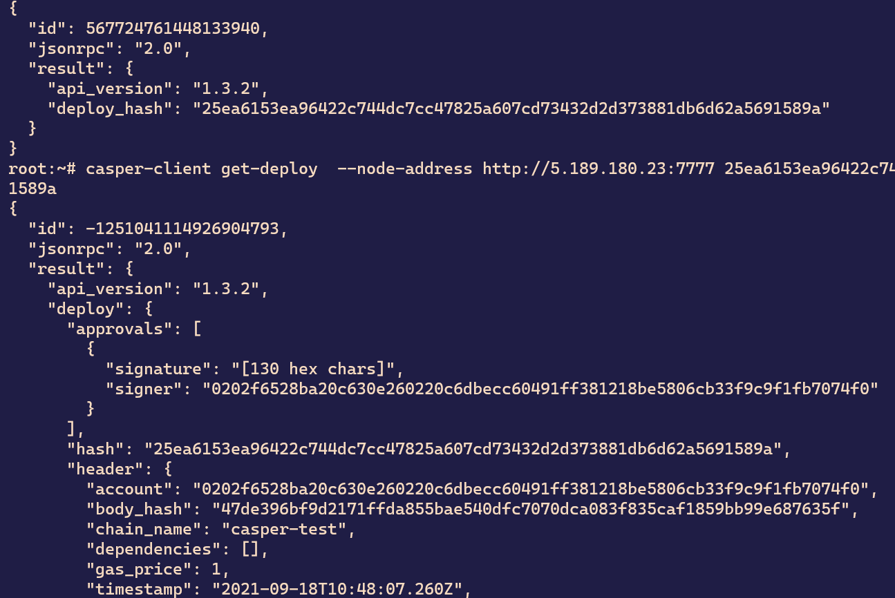

# Get Started With Casper (First 100 Submissions)


## 1. Create and deploy a simple, smart contract with cargo casper and cargo test


### The screenshot of build and test


### The screenshot of deploying the contract to testnet and The screenshot of the deployment status:





## 2. Complete one of the existing tutorials for writing smart contracts

<b>ERC-20 Tutorial
</b>

The screenshot of build

Thescreenshot of test

## 3. Demonstrate key management concepts by modifying the client in the Multi-Sig tutorial to address one of the additional scenarios
<b>select the frist</b>

### modifying the client
```
const keyManager = require('./key-manager');
const TRANSFER_AMOUNT = process.env.TRANSFER_AMOUNT || 2500000000;

(async function () {
    
    // In this example the 2 additional accounts will be added to 
    // the mainAccount to perform deploys, but they will not be 
    // able to add another account. 
    
    // To achive the task, we will:
    // 2. Set Keys Management Threshold to 2.
    // 3. Set Deploy Threshold to 1.
    // 4. Add first new key with weight 1 (first account).
    // 5. Add second new key with weight 1 (second account).


    let deploy;

    // 0. Initial state of the account.
    // There should be only one associated key (facuet) with weight 1.
    // Deployment Threshold should be set to 1.
    // Key Management Threshold should be set to 1.
    let masterKey = keyManager.randomMasterKey();
    let mainAccount = masterKey.deriveIndex(1);
    let firstAccount = masterKey.deriveIndex(2);
    // let secondAccount = masterKey.deriveIndex(3);

    console.log("\n0.1 Fund main account.\n");
    await keyManager.fundAccount(mainAccount);
    await keyManager.printAccount(mainAccount);
    
    console.log("\n[x]0.2 Install Keys Manager contract");
    deploy = keyManager.keys.buildContractInstallDeploy(mainAccount);
    await keyManager.sendDeploy(deploy, [mainAccount]);
    await keyManager.printAccount(mainAccount);

    // 1. Add first new key with weight 1 (first account).
    console.log("\n1. Add first new key with weight 1.\n");
    deploy = keyManager.keys.setKeyWeightDeploy(mainAccount, firstAccount, 1);
    await keyManager.sendDeploy(deploy, [mainAccount]);
    await keyManager.printAccount(mainAccount);
    
    // 2. Set Keys Management Threshold to 2.
    console.log("\n2. Set Keys Management Threshold to 2\n");
    deploy = keyManager.keys.setKeyManagementThresholdDeploy(mainAccount, 2);
    await keyManager.sendDeploy(deploy, [mainAccount]);
    await keyManager.printAccount(mainAccount);
    
    // // 3. Set Deploy Threshold to 1.
    // console.log("\n3. Set Deploy Threshold to 1.\n");
    // deploy = keyManager.keys.setDeploymentThresholdDeploy(mainAccount, 1);
    // await keyManager.sendDeploy(deploy, [mainAccount]);
    // await keyManager.printAccount(mainAccount);
    
    // 4. Add first new key with weight 1 (first account).
    // console.log("\n4. Add first new key with weight 1.\n");
    // deploy = keyManager.keys.setKeyWeightDeploy(mainAccount, firstAccount, 1);
    // await keyManager.sendDeploy(deploy, [mainAccount]);
    // await keyManager.printAccount(mainAccount);
    
    // // 5. Add second new key with weight 1 (second account).
    // console.log("\n5. Add second new key with weight 1.\n");
    // deploy = keyManager.keys.setKeyWeightDeploy(mainAccount, secondAccount, 1);
    // await keyManager.sendDeploy(deploy, [mainAccount]);
    // await keyManager.printAccount(mainAccount);
    
    // // 6. Make a transfer from faucet using the new accounts.
    // console.log("\n6. Make a transfer from faucet using the new accounts.\n");
    // deploy = keyManager.transferDeploy(mainAccount, firstAccount, TRANSFER_AMOUNT);
    // await keyManager.sendDeploy(deploy, [firstAccount, secondAccount]);
    // await keyManager.printAccount(mainAccount);
    
    // // 7. Remove first account.
    // console.log("\n7. Remove the first account\n");
    // deploy = keyManager.keys.setKeyWeightDeploy(mainAccount, firstAccount, 0);
    // await keyManager.sendDeploy(deploy, [mainAccount]);
    // await keyManager.printAccount(mainAccount);
    
    // // 8. Remove second account.
    // console.log("\n8. Remove the second account\n");
    // deploy = keyManager.keys.setKeyWeightDeploy(mainAccount, secondAccount, 0);
    // await keyManager.sendDeploy(deploy, [mainAccount]);
    // await keyManager.printAccount(mainAccount);
    
})();


```
### edit the json file
`    "start:first": "node -r dotenv/config ./src/scenario-three.js",
`
### Final result:


## 4. Learn to transfer tokens to an account on the Casper Testnet. Check out this documentation.
### Screnshot of transfering tokens and deployment status:


## 5.Learn to Delegate and Undelegate on the Casper Testnet. Check out these instructions.
### Screenshot of delegating on the Casper Testnet:


### Screenshot of undelegating on the Casper Testnet:


